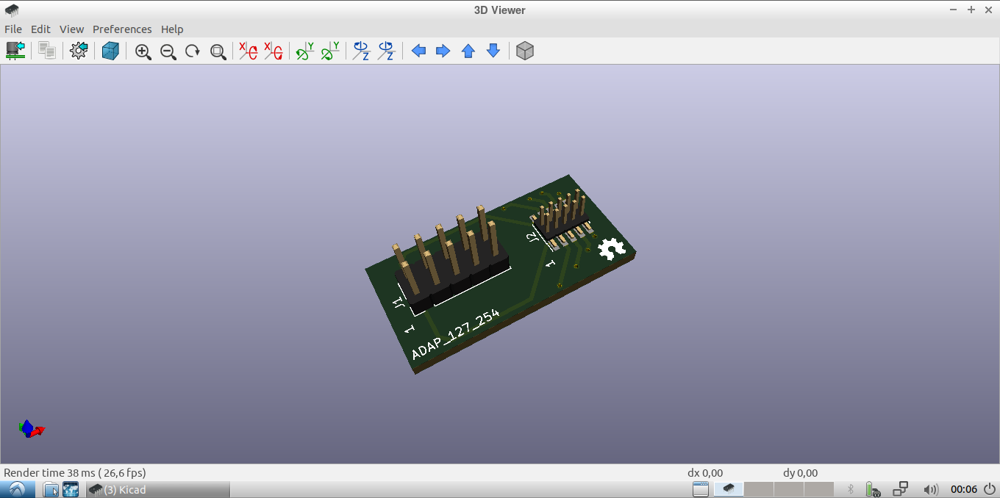

# Circuito impreso,  adaptador de conector 2x5 pines 1.27 mm macho a conector 2x5 pines  de 2.54 mm  macho

Esta tarjeta fue creada para convertir del conector "pequeño" de 1.27 mm que trae el  Programador-Depurador J-Link EDU Mini a un conector macho de 2.54 mm.

*Lea esto en otros idiomas: [English](../README.md)*

El programado  J-Link EDU Mini viene con un conector de  2x5 pines  1.27 mm macho e incluye ribbon hembra hembra de 2x5 pines 1.27mm para conexion al dispositivo destino.

If for some reason your target doesn't have the same connector (debug pins scattered somewhere on the PCB), or want to connect to a circuit on a breadboard, this PCB will ease the task. 
## Como usar este repositorio

El circuito impreso fue desarrollado en KiCad V5.1, e incluye algunos elementos que un no han sido agregados al repositorio oficial de las librerias de KiCad.  To make sure nothing  will break on the future, all the KiCad libraries were included as git submodules, so to clone the repo use the  --recursive option to get all submodules (about 5 Gb !!).

To setup KiCad to use the downloaded library from the repo instead of the stock that came with the installer, [this post](https://forum.kicad.info/t/library-management-in-kicad-version-5/14636) will give you some lights.

## Estructura de directorios

* El directorio raiz contiene los archivos de  KiCad: proyecto, esquematico y circuito impreso.
* library directory (git submodule) contains schematics symbol libraries.
* modules directory (git submodule) contains footprint libraries.
* packages3d directory (git submodule) contains 3D model libraries.
* gerber/single directory contains ready to manufacture files, for a single board.
* gerber/panel_100mmx100mm directory contains ready to manufacture files that fits in a 100mm x 100mm panel (use Vcuts!).
* docs directory some additional info about the project.

## Licencia

Este traabjo esta licenciado bajo una licencia [Creative Commons Attribution 4.0 International License](http://creativecommons.org/licenses/by/4.0/).
